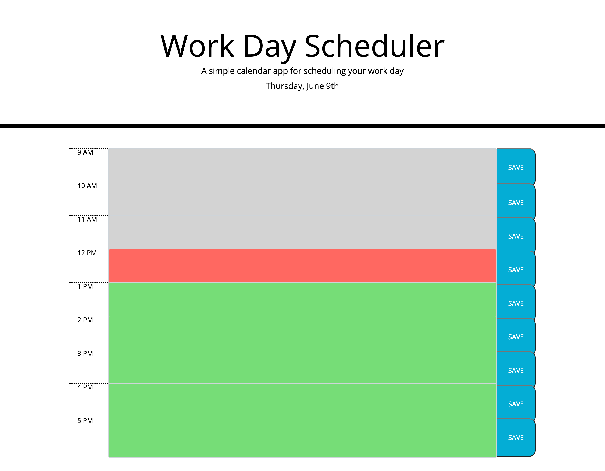

Day Workday Planner 

Created a day planner for the working hours of 9:00 am - 5:00 pm. 
Color cordinated the past, present and future. The User can be aware of the upcoming and current events they have input into the daily calendar. The past will appear grey but with its older input saved. 
The user has the option to save any task or notes for that hour block. 

URL: https://kpresents.github.io/day-planner-/